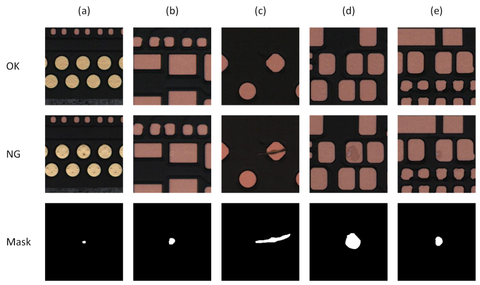

# MeiweiPCB Surface Defect Dataset

#### Description
The PCB surface defect dataset is collected to solve the problem of automatic recognition of printed circuit board. 
A common strategy has been used to increase the diversity of the dataset, which randomly cut out patches with a resolution of 220x220 from the raw images captured by an industrial line scan camera. 
Most of these defect images contain a series of noise, e.g., the diversity of defect shape, complexity of texture, and the change of illumination intensity.
The complete dataset will be released later.

The file structure is introduced as follows:

- MeiweiPCB
    - images: the collected defect/NG images
    - images_nor: the corresponding normal/OK images without any defects
    - mask: the pixel-wise mask annotations
    - annotations_txt: the bounding box annotations
    - annotations_coco: divide the training set, validation set and test set according to the commonly used coco format

It can be seen that the dataset can be used for various different vision tasks. 
Enjoy it! :tw-1f495: 

